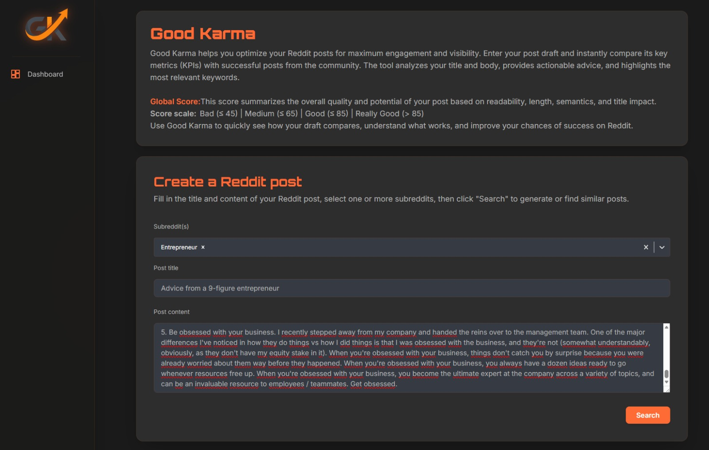
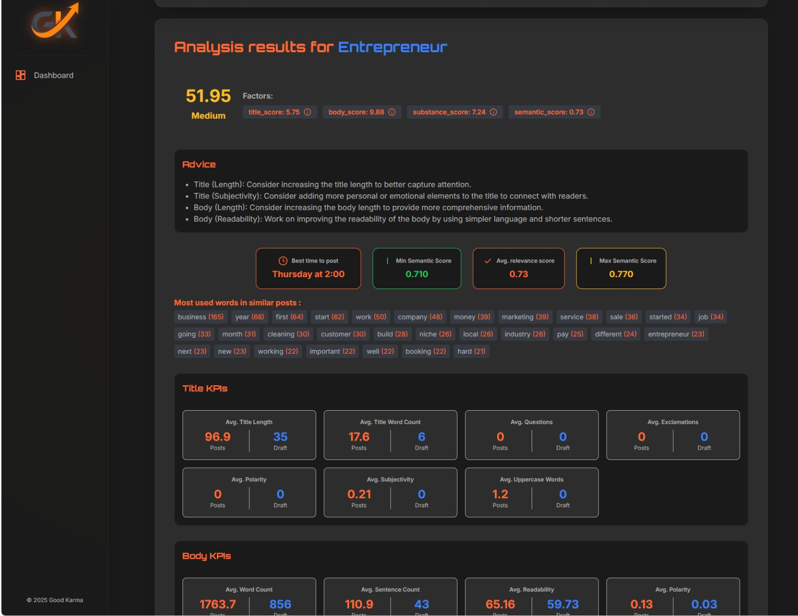
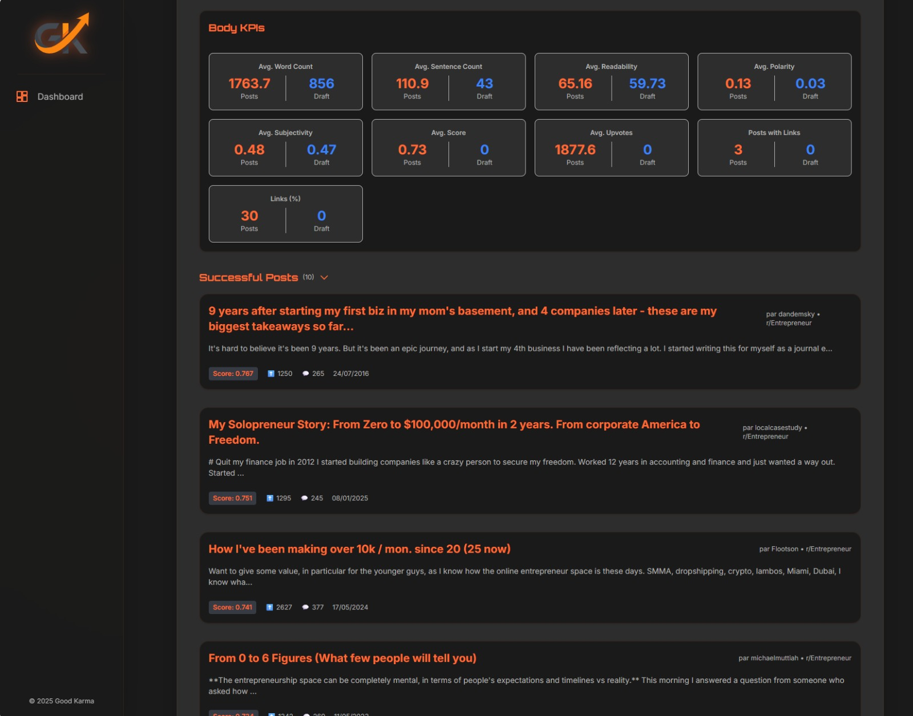

<p align="center">
	
</p>


<p align="center">
	<table>
		<tr>
			<td align="center">
				<br/>
				<i>Application overview</i>
			</td>
			<td align="center">
				<br/>
				<i>Reddit post analysis</i>
			</td>
			<td align="center">
				<br/>
				<i>Advice & KPIs</i>
			</td>
		</tr>
	</table>
</p>

# Good Karma

<p align="center">
	<a href="./LICENSE"></a>
	
	
	
	
</p>

Good Karma is an open-source Reddit post analysis platform designed to help founders, indie makers, and growth teams improve a post before it is published. It combines a Next.js frontend, a FastAPI backend, and a Qdrant vector database to compare a draft against previously collected Reddit content and return actionable signals such as KPIs, advice, and similar posts.

This repository is published for people who want to understand it, run it, improve it, and keep it alive.


## Example Use Cases

Good Karma can be leveraged in various real-world scenarios to maximize the impact of Reddit posts and community engagement. Here are some concrete examples:

### For Entrepreneurs & Startups
- **Product Launches:** Test and optimize your Reddit announcement before posting to maximize upvotes and engagement.
- **Market Validation:** Compare your draft with successful posts in your target subreddits to refine messaging and positioning.
- **Community Building:** Get advice on tone and structure to foster authentic discussions and avoid common pitfalls.

### For Retail & E-commerce
- **Promotional Campaigns:** Analyze promotional drafts to ensure they align with subreddit rules and community expectations.
- **Customer Feedback:** Share product updates or feedback requests and receive suggestions to improve clarity and engagement.

### For Content Creators & Marketers
- **Content Optimization:** Benchmark your post against high-performing content to increase visibility and reach.
- **Trend Analysis:** Discover what topics and formats resonate most in your niche.

### For Researchers & Analysts
- **Sentiment & KPI Analysis:** Use the tool to study engagement patterns and sentiment across different subreddits or topics.

### Other Use Cases
- **Nonprofits & Advocacy:** Craft compelling awareness posts and measure their likely impact before publishing.
- **Recruitment:** Optimize job or collaboration offers for relevant communities.

If you have a unique use case, feel free to contribute it to the project!


## Why This Project Exists

Writing a strong Reddit post is harder than it looks. A post can be technically correct and still fail because the title is weak, the framing is unclear, the tone does not fit the subreddit, or the structure does not invite engagement.

Good Karma exists to make that process less subjective.

Instead of relying only on intuition, the project helps users evaluate a draft with a combination of:

- content-level KPIs
- engagement-oriented heuristics
- semantic comparison against previously collected Reddit posts
- subreddit-aware exploration

The goal is not to automate writing. The goal is to give better feedback before publishing.

## Why It Is Open Source

This project is being open sourced for both practical and long-term reasons.

Practically, we no longer have enough time to keep evolving it alone at the pace it deserves. Rather than let it stagnate in a private repository, we want it to remain useful, inspectable, and improvable.

Long term, this kind of tool becomes more valuable when multiple people can maintain it, challenge its assumptions, improve the data pipeline, harden the deployment model, and adapt it to new use cases. Open sourcing Good Karma is a way to turn a constrained duo project into a shared foundation that can keep moving.

If you care about Reddit growth workflows, applied NLP, vector search, or productized developer tooling, you are exactly the kind of person this repository is now for.

## Project Status

Good Karma is functional, but it should be treated as an evolving open-source codebase rather than a finished product.

- The core architecture is in place.
- The backend depends on Qdrant being available at startup.
- The knowledge base must be populated before semantic search becomes useful.
- The repository is now intended to be maintainable by more than one person.

Contributions are welcome, especially around deployment, robustness, documentation, data ingestion, and product quality.

## What It Does

At a high level, Good Karma lets a user submit a Reddit draft and receive:

- KPI-style signals derived from the post content
- advice intended to improve clarity and engagement
- semantically similar posts retrieved from a Qdrant collection
- subreddit-related context to guide targeting

## Architecture Overview

Good Karma is split into three main runtime components:

1. Frontend: a Next.js application that handles the user interface and proxies requests to the backend API.
2. Backend: a FastAPI service that initializes the NLP model, connects to Qdrant, computes analysis signals, and serves the search endpoints.
3. Vector database: a Qdrant instance that stores embedded Reddit posts and serves semantic similarity search.

```text
User
	|
	v
Next.js frontend
	|
	v
FastAPI backend
	|
	v
Qdrant vector database
```

The backend initializes Qdrant during application startup. That means Qdrant must already be running before the API is launched, otherwise the backend will fail early.

## Repository Structure

```text
.
|-- Morlana_backend/
|   |-- app.py
|   |-- app_manual.py
|   |-- requirements.txt
|   |-- Configuration/
|   |-- Routes/
|   `-- App/
|-- Morlana_frontend/
|   |-- app/
|   |-- components/
|   |-- package.json
|   `-- Dockerfile
|-- CODE_OF_CONDUCT.md
|-- LICENSE
`-- README.md
```

## Tech Stack

- Frontend: Next.js 16, React 19, TypeScript
- Backend: FastAPI, Python 3.10
- Vector search: Qdrant
- NLP and text processing: Python tooling from the backend requirements
- Containerization: Docker for backend, frontend, and Qdrant


## Running the Project with Docker Compose

To launch the entire project (backend, frontend, Qdrant) with a single command, use Docker Compose at the root of the repository:

```bash
docker-compose up --build
```

This will:
- start Qdrant with a persistent storage volume
- launch the backend (FastAPI) after Qdrant is ready
- launch the frontend (Next.js)

The backend URL will be automatically passed to the frontend.

To stop all services:

```bash
docker-compose down
```

For advanced configuration or environment variable changes, refer to the README files in:
- `Morlana_backend/README.md` for the backend
- `Morlana_frontend/README.md` for the frontend

## Running Only the Backend or Frontend

Detailed instructions for running the backend or frontend separately (dependency installation, configuration, start commands) are available in their respective README files:

- [Backend – Morlana_backend/README.md](Morlana_backend/README.md)
- [Frontend – Morlana_frontend/README.md](Morlana_frontend/README.md)

## API Surface

The backend exposes an API focused on Reddit draft analysis and subreddit management:

- `/`: healthcheck and version
- `/search`: Reddit draft analysis
- `/subreddits`: subreddit management
- `/docs`: FastAPI interactive documentation

For a local instance, the API documentation is available at:
`http://localhost:8000/docs`

## Contributing

Contributions are welcome.

If you plan to contribute, prefer the following workflow:

1. Open an issue for bugs, design gaps, or major feature ideas.
2. Keep pull requests focused and reviewable.
3. Explain behavioral changes clearly, especially if they affect scoring, ingestion, or deployment.
4. Update documentation when changing configuration or runtime behavior.
5. Do not assume private infrastructure or hidden context; changes should remain understandable from the public repository.

Areas where contributions are especially valuable:

- Docker Compose and production deployment hardening
- test coverage
- better developer onboarding
- frontend UX improvements
- ingestion reliability and observability
- search quality and ranking logic
- clearer KPI explanations

## Maintainer Expectations

This repository is open source because it should outlive a single maintainer's bandwidth.

That means contributions are not just accepted in principle, they are part of the project strategy. If you want to help maintain the project, improve the roadmap, or make the deployment story stronger, that is welcome.

The best contributions for a project in this stage are usually:

- small, well-scoped fixes
- documentation improvements
- setup simplifications
- reproducibility improvements
- carefully explained architectural changes

## Code of Conduct

This project uses the Contributor Covenant. Please read `CODE_OF_CONDUCT.md` before participating in discussions, issues, or pull requests.

## License

This project is licensed under the GNU Affero General Public License v3.0.

If you deploy a modified version of this software as a network service, AGPL-3.0 obligations apply. Read the `LICENSE` file carefully before redistributing or hosting derived versions.


## About the Founders

**Elie EL DEBS**  
Future PhD candidate specializing in neuro-symbolic AI and agentic systems. Elie has 5 years of experience in artificial intelligence, with a strong background in computer vision, machine learning, and applied research.

**Julien Champagne**  
AI engineer with over 3 years of experience in computer vision and artificial intelligence projects, with a focus on practical applications and robust system design.

We are passionate about building tools that bridge research and real-world impact. Feel free to reach out for collaboration, questions, or contributions!
