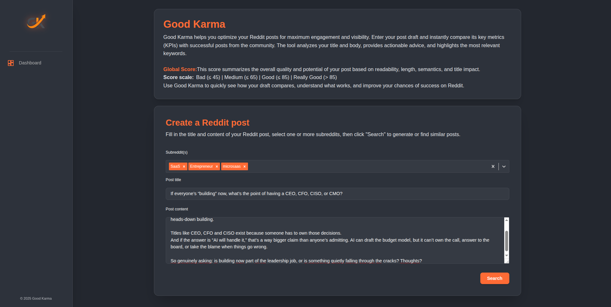
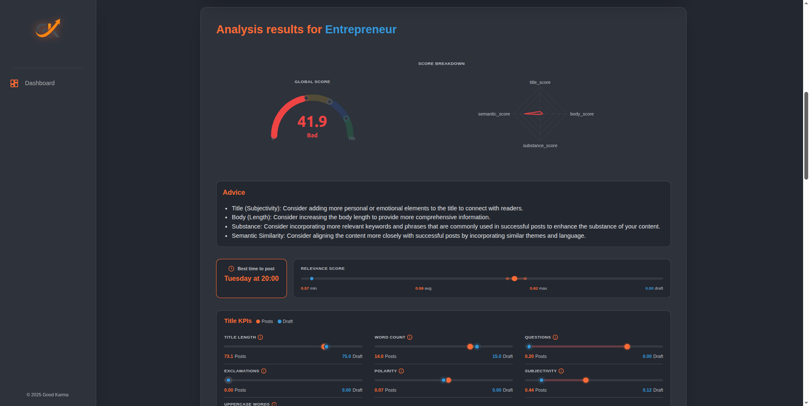
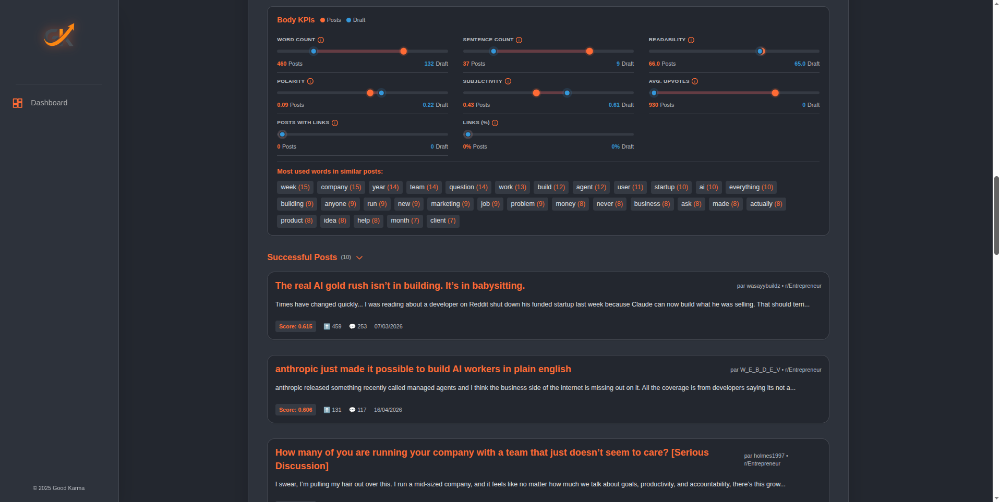

<p align="center">
	
</p>

# Good Karma

<p align="center">
	<strong>An open-source platform to analyze and optimize Reddit posts before publishing</strong>
</p>

<p align="center">
	<a href="./LICENSE"></a>
	
	
	
	
	
	
</p>

---

## 📋 Table of Contents

- [Overview](#overview)
- [Features](#features)
- [Why Good Karma](#why-good-karma)
- [Screenshots](#screenshots)
- [Tech Stack](#tech-stack)
- [Architecture](#architecture)
- [Quick Start](#quick-start)
- [Installation](#installation)
- [Usage](#usage)
- [Project Structure](#project-structure)
- [API Reference](#api-reference)
- [Contributing](#contributing)
- [License](#license)
- [Support](#support)

## Overview

**Good Karma** is an open-source Reddit post analysis platform designed to help founders, indie makers, content creators, and growth teams optimize their posts before publishing. It combines a Next.js frontend, a FastAPI backend, and a Qdrant vector database to compare a draft against previously collected Reddit content and return actionable signals such as KPIs, advice, and similar posts.

Instead of relying on intuition alone, Good Karma gives data-driven feedback to improve clarity, engagement, and community fit before your post goes live.

## Features

- 🎯 **Content KPIs**: Extract readability, sentiment, structure, and engagement metrics from drafts
- 💡 **Actionable Advice**: Receive specific, context-aware suggestions to improve posts
- 🔍 **Semantic Search**: Find similar high-performing posts from your target subreddits
- 📊 **Engagement Scoring**: Compare your draft against successful posts in your community
- ⏰ **Timing Recommendations**: Discover optimal posting times for your target subreddits
- 🛡️ **API Key Security**: Secure endpoints with authentication
- 🐳 **Docker Support**: One-command deployment with Docker Compose

## Why Good Karma

Writing a strong Reddit post is harder than it looks. A post can be technically correct and still fail because:
- The title is weak or unclear
- The framing doesn't match subreddit culture
- The tone is off
- The structure doesn't invite engagement

Good Karma removes the guesswork by analyzing your draft against:
- Content-level KPIs (readability, sentiment, structure)
- Engagement-oriented heuristics
- Semantic comparison against previously collected Reddit posts
- Subreddit-specific context and expectations

**The goal is not to automate writing. The goal is to give better feedback before publishing.**

## Screenshots

<p align="center">
	<table>
		<tr>
			<td align="center">
				<br/>
				<i>📊 Application overview</i>
			</td>
			<td align="center">
				<br/>
				<i>✏️ Reddit post analysis</i>
			</td>
			<td align="center">
				<br/>
				<i>💬 Advice & KPIs</i>
			</td>
		</tr>
	</table>
</p>

## Use Cases


### For Entrepreneurs & Startups
- **Product Launches:** Test and optimize your Reddit announcement before posting to maximize upvotes and engagement
- **Market Validation:** Compare your draft with successful posts to refine messaging and positioning
- **Community Building:** Get advice on tone and structure to foster authentic discussions

### For Content Creators & Marketers
- **Content Optimization:** Benchmark your post against high-performing content to increase visibility
- **Trend Analysis:** Discover what topics and formats resonate in your niche
- **Audience Targeting:** Understand which subreddits and timing work best for your content type

### For Researchers & Analysts
- **Sentiment Analysis:** Study engagement patterns and sentiment across subreddits
- **Data-Driven Posts:** Analyze what makes posts successful in specific communities
- **Academic Posts:** Optimize research announcements for maximum reach

### For Nonprofits & Recruitment
- **Awareness Campaigns:** Craft compelling nonprofit and advocacy posts with measured impact
- **Job Postings:** Optimize recruitment messages for relevant communities

## Tech Stack

| Component | Technology | Version |
|-----------|-----------|---------|
| **Frontend** | Next.js, React, TypeScript, Tailwind CSS | 16, 19, 5, 4 |
| **Backend** | FastAPI, Python, Sentence Transformers | 0.119+, 3.10+, 5.1+ |
| **Vector DB** | Qdrant | Latest |
| **NLP Tools** | PRAW, scikit-learn, TextBlob, NLTK | Latest |
| **Containerization** | Docker & Docker Compose | Latest |

## Architecture

Good Karma follows a modular three-tier architecture:

```
┌──────────────────────────────────────────────────────────────┐
│                    User Interface (Web)                       │
│           Next.js Frontend (React 19, TypeScript)            │
│                  Port: 3000 (development)                    │
└──────────────────────┬───────────────────────────────────────┘
                       │
                       │ HTTP REST API
                       │
┌──────────────────────▼───────────────────────────────────────┐
│                  Backend API Service                          │
│        FastAPI (Python 3.10+, async processing)             │
│  ├─ Search Endpoint: Analyze drafts & compute KPIs          │
│  ├─ Subreddits Endpoint: Manage subreddit metadata          │
│  ├─ Health Check: System status                             │
│  └─ API Key Security: Authentication layer                  │
│                  Port: 8000 (development)                    │
└──────────────────────┬───────────────────────────────────────┘
                       │
                       │ Vector Search & Embeddings
                       │
┌──────────────────────▼───────────────────────────────────────┐
│              Vector Database (Qdrant)                         │
│  ├─ Stores embeddings of Reddit posts                       │
│  ├─ Performs semantic similarity search (cosine distance)   │
│  ├─ Default dimension: 768 (Sentence Transformers)          │
│  └─ Persistent storage via Docker volume                    │
│                  Port: 6333 (API), 6334 (Web UI)            │
└──────────────────────────────────────────────────────────────┘
```

**Data Flow:**
1. User submits a Reddit draft via the frontend
2. Backend loads draft, computes KPIs (readability, sentiment, structure)
3. Backend generates embeddings using Sentence Transformers
4. Backend queries Qdrant for semantically similar posts
5. Results (KPIs, advice, similar posts) returned to frontend

## Project Status

✅ **Core functionality is complete and operational**

- ✅ Full-stack application with Next.js, FastAPI, and Qdrant
- ✅ KPI extraction and analysis (readability, sentiment, engagement scoring)
- ✅ Semantic search via vector embeddings
- ✅ API key security
- ⚠️ No comprehensive test suite (contribution opportunity)
- ⚠️ Knowledge base must be pre-populated before search is useful

This is an evolving open-source project maintained by the community. Contributions are welcome, especially in:
- Deployment hardening and scaling
- Test coverage
- Documentation improvements
- Data ingestion pipelines
- UI/UX enhancements

## Quick Start

### Prerequisites
- **Docker & Docker Compose** (recommended for quickest setup)
  OR
- **Python 3.10+** + **Node.js 18+** + **Qdrant** (for local development)

### 1️⃣ Run with Docker Compose (Recommended)

```bash
# Clone the repository
git clone https://github.com/ElieElDebs/Good-Karma.git
cd Good-Karma

# Start all services (Qdrant, Backend, Frontend)
docker-compose up --build

# Access the application
# Frontend: http://localhost:3000
# Backend API: http://localhost:8000/docs (Swagger UI)
# Qdrant Web UI: http://localhost:6334
```

**To stop:**
```bash
docker-compose down
```

### 2️⃣ Run Locally (Development)

See the [Installation](#installation) section below for detailed local setup.

## Installation

### Option A: Docker Compose (All Services)

```bash
git clone https://github.com/ElieElDebs/Good-Karma.git
cd Good-Karma

docker-compose up --build
```

✅ All three services start automatically:
- **Qdrant** (port 6333)
- **Backend** (port 8000)
- **Frontend** (port 3000)

### Option B: Local Development Setup

#### Backend Setup

```bash
cd Morlana_backend

# Create and activate virtual environment
python -m venv venv
source venv/bin/activate  # Windows: venv\Scripts\activate

# Install dependencies
pip install -r generic.txt  # For CPU; use gpu.txt for GPU support

# Download NLTK data (required for text processing)
python -m nltk.downloader stopwords punkt wordnet punkt_tab

# Configure environment
cp Configuration/.env.example Configuration/.env
# Edit Configuration/.env with your Qdrant host/port and Reddit API credentials

# Start Qdrant separately
docker run -d -p 6333:6333 -p 6334:6334 -v qdrant_storage:/qdrant/storage qdrant/qdrant

# Start the backend
uvicorn app:app --reload
# API available at http://localhost:8000/docs
```

#### Frontend Setup

```bash
cd Morlana_frontend

# Install dependencies
npm install

# Start development server
npm run dev

# Available at http://localhost:3000
```

## Usage

### Basic Workflow

1. **Open the application** at http://localhost:3000
2. **Enter your Reddit draft:**
   - Title (post headline)
   - Body (post content)
   - Target subreddits (e.g., r/test, r/AskReddit)
3. **Receive analysis:**
   - Content KPIs (readability, structure, sentiment)
   - Engagement score comparison
   - Similar high-performing posts
   - Actionable advice for improvement
4. **Refine your post** based on feedback
5. **Publish with confidence** 🚀

### API Usage

If you want to integrate Good Karma into your own tools:

```bash
# Health check
curl http://localhost:8000/

# Analyze a draft (requires API key)
curl -H "X-API-Key: your_key_here" \
  "http://localhost:8000/search?title=My%20Post&body=Content&subreddits=r/test"

# Interactive API documentation
# Visit http://localhost:8000/docs (Swagger UI)
```

See [API Reference](#api-reference) for complete endpoint documentation.

## Project Structure

```
.
├── Morlana_backend/           # FastAPI backend
│   ├── app.py                 # Main application entry point
│   ├── app_manual.py          # Data ingestion script
│   ├── generic.txt            # Python dependencies (CPU)
│   ├── gpu.txt                # Python dependencies (GPU)
│   ├── Configuration/         # Config files and environment
│   ├── Routes/                # API endpoints
│   └── App/
│       ├── Database/          # Qdrant client & initialization
│       ├── Middleware/        # Business logic (search, KPIs)
│       └── Utils/             # KPI calculations, scoring, Reddit API
│
├── Morlana_frontend/          # Next.js frontend
│   ├── app/
│   │   ├── layout.tsx         # Root layout
│   │   ├── page.tsx           # Main application page
│   │   ├── components/        # React components
│   │   │   ├── KpiSection.tsx
│   │   │   ├── ScoreGauge.tsx
│   │   │   ├── SpiderChart.tsx
│   │   │   └── ...
│   │   ├── api/               # API route handlers
│   │   └── globals.css        # Global styles
│   ├── package.json
│   ├── tsconfig.json
│   ├── next.config.ts
│   └── Dockerfile
│
├── docker-compose.yml         # Service orchestration
├── CLAUDE.md                  # Developer guidance
├── CODE_OF_CONDUCT.md         # Community guidelines
├── LICENSE                    # AGPL-3.0 license
└── README.md                  # This file
```

## API Reference

### Endpoints

**Health & Info:**
- `GET /` - System health check and version information

**Search & Analysis:**
- `GET /search?title=...&body=...&subreddits=r/test&subreddits=r/other` (requires `X-API-Key` header)
  - Analyzes a Reddit draft and returns KPIs, engagement scores, similar posts, and advice
  - Returns: JSON with analysis results

**Subreddit Management:**
- `GET /subreddits` - List available subreddits
- `POST /subreddits` - Add or update subreddit metadata

**Documentation:**
- `GET /docs` - Interactive Swagger UI (auto-generated by FastAPI)
- `GET /openapi.json` - OpenAPI schema

### Authentication

The `/search` endpoint requires API key authentication via the `X-API-Key` header:

```bash
curl -H "X-API-Key: your_api_key" \
  "http://localhost:8000/search?title=Draft%20Title&body=Draft%20Body&subreddits=r/test"
```

**Full API Documentation:**  
When running locally, visit [`http://localhost:8000/docs`](http://localhost:8000/docs) for interactive API documentation.

For backend-specific details, see [Morlana_backend/README.md](Morlana_backend/README.md).

## Configuration

### Environment Variables

#### Backend (`Morlana_backend/Configuration/.env`)

```env
# Qdrant Vector Database
QDRANT_HOST = localhost
QDRANT_PORT = 6333
QDRANT_COLLECTION_NAME = morlana_collection
QDRANT_VECTOR_SIZE = 768
QDRANT_DISTANCE = cosine

# Reddit API (for data ingestion)
client_id = <your_reddit_app_id>
client_secret = <your_reddit_app_secret>
user_agent = <your_user_agent>

# API Authentication (Required)
API_KEY = <your_api_key>
```

#### Frontend (`Morlana_frontend/.env`)

```env
# Backend API URL
NEXT_PUBLIC_API_URL = http://localhost:8000/

# API Key for authentication (Required)
NEXT_PUBLIC_API_KEY = <your_api_key>
```

**Note:** The `API_KEY` must match between backend and frontend for successful authentication.

## Contributing

We welcome contributions from the community! Whether you're fixing bugs, adding features, improving documentation, or helping with deployment—your help is valued.

### Contribution Guidelines

1. **Start with an Issue:**
   - For bugs: report with reproduction steps
   - For features: discuss the idea first
   - For docs: improvements welcome anytime

2. **Pull Request Process:**
   - Keep PRs focused and reviewable (single feature/fix per PR)
   - Write clear commit messages
   - Update documentation if needed
   - Reference the related issue in your PR description

3. **Code Standards:**
   - **Frontend:** Follow ESLint rules (`npm run lint .`)
   - **Backend:** Format with black (`black .`)
   - Both: Write self-documenting code; avoid unnecessary comments

4. **Testing:**
   - Add tests for new features
   - Run existing tests before submitting
   - Help us build test coverage (currently absent)

### Priority Areas for Contributions

- 🧪 **Test Coverage** - We currently lack comprehensive tests
- 🐳 **Deployment** - Docker, Kubernetes, or managed deployment improvements
- 📚 **Documentation** - Tutorials, architecture docs, deployment guides
- 🎨 **Frontend UX** - UI improvements, mobile responsiveness, accessibility
- 🔍 **Search Quality** - Better ranking, more relevant similar posts
- 🤖 **Data Ingestion** - More reliable data pipelines, better sampling
- 🔌 **Integrations** - Browser extensions, APIs, webhooks

For detailed development setup and workflow, see [CLAUDE.md](CLAUDE.md).

## Code of Conduct

This project adheres to the [Contributor Covenant Code of Conduct](CODE_OF_CONDUCT.md). By participating, you agree to uphold these standards.

## License

**GNU Affero General Public License v3.0** (AGPL-3.0)

This means:
- ✅ You can use, modify, and distribute Good Karma
- ✅ If you host a modified version as a service, you must share your code
- ⚠️ This is not a permissive license—read [LICENSE](LICENSE) carefully before deploying

For commercial use or special licensing, please reach out.

## Support & Community

- **Issues & Bugs:** [GitHub Issues](https://github.com/ElieElDebs/Good-Karma/issues)
- **Feature Requests:** Use GitHub Issues with the [FEATURE] tag
- **Discussions:** GitHub Discussions (coming soon)
- **Email:** elie.eldebs@outlook.fr

## Acknowledgments

Built with:
- [Next.js](https://nextjs.org) - React framework
- [FastAPI](https://fastapi.tiangolo.com) - Modern Python API framework
- [Qdrant](https://qdrant.tech) - Vector similarity search
- [Sentence Transformers](https://www.sbert.net) - Semantic embeddings
- [PRAW](https://praw.readthedocs.io) - Reddit API wrapper
- And many more great open-source tools

## About the Founders

**Elie El Debs**  
Future PhD candidate specializing in neuro-symbolic AI and agentic systems. Elie brings 5+ years of experience in artificial intelligence, with a strong background in computer vision, machine learning, and applied research.  
📧 elie.eldebs@outlook.fr

**Julien Champagne**  
AI engineer with 3+ years of experience in computer vision and AI projects, focused on practical applications and robust system design.

---

<p align="center">
  Made with ❤️ by the Good Karma team  
  <br>
  <strong><a href="https://github.com/ElieElDebs/Good-Karma">⭐ Star us on GitHub if you find this useful!</a></strong>
</p>
