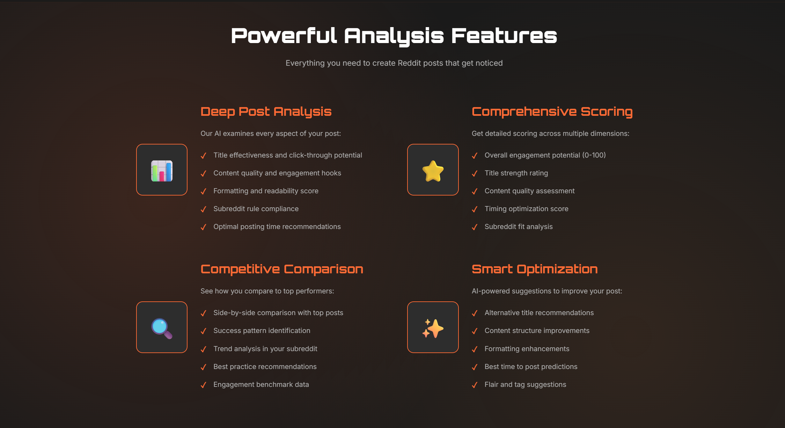

<p align="center">
	
</p>

<p align="center">
  
</p>
<p align="center"><i>Exemple de la landing page et des fonctionnalités principales de Good Karma</i></p>

# Good Karma

<p align="center">
	<a href="./LICENSE"></a>
	
	
	
	
</p>

Good Karma is an open-source Reddit post analysis platform designed to help founders, indie makers, and growth teams improve a post before it is published. It combines a Next.js frontend, a FastAPI backend, and a Qdrant vector database to compare a draft against previously collected Reddit content and return actionable signals such as KPIs, advice, and similar posts.

This repository is published for people who want to understand it, run it, improve it, and keep it alive.

## Why This Project Exists

Writing a strong Reddit post is harder than it looks. A post can be technically correct and still fail because the title is weak, the framing is unclear, the tone does not fit the subreddit, or the structure does not invite engagement.

Good Karma exists to make that process less subjective.

Instead of relying only on intuition, the project helps users evaluate a draft with a combination of:

- content-level KPIs
- engagement-oriented heuristics
- semantic comparison against previously collected Reddit posts
- subreddit-aware exploration

The goal is not to automate writing. The goal is to give better feedback before publishing.

## Why It Is Open Source

This project is being open sourced for a practical reason and for a long-term one.

Practically, I no longer have enough time to keep evolving it alone at the pace it deserves. Rather than let it stagnate in a private repository, I want it to remain useful, inspectable, and improvable.

Long term, this kind of tool becomes more valuable when multiple people can maintain it, challenge its assumptions, improve the data pipeline, harden the deployment model, and adapt it to new use cases. Open sourcing Good Karma is a way to turn a constrained solo project into a shared foundation that can keep moving.

If you care about Reddit growth workflows, applied NLP, vector search, or productized developer tooling, you are exactly the kind of person this repository is now for.

## Project Status

Good Karma is functional, but it should be treated as an evolving open-source codebase rather than a finished product.

- The core architecture is in place.
- The backend depends on Qdrant being available at startup.
- The knowledge base must be populated before semantic search becomes useful.
- The repository is now intended to be maintainable by more than one person.

Contributions are welcome, especially around deployment, robustness, documentation, data ingestion, and product quality.

## What It Does

At a high level, Good Karma lets a user submit a Reddit draft and receive:

- KPI-style signals derived from the post content
- advice intended to improve clarity and engagement
- semantically similar posts retrieved from a Qdrant collection
- subreddit-related context to guide targeting

## Architecture Overview

Good Karma is split into three main runtime components:

1. Frontend: a Next.js application that handles the user interface and proxies requests to the backend API.
2. Backend: a FastAPI service that initializes the NLP model, connects to Qdrant, computes analysis signals, and serves the search endpoints.
3. Vector database: a Qdrant instance that stores embedded Reddit posts and serves semantic similarity search.

```text
User
	|
	v
Next.js frontend
	|
	v
FastAPI backend
	|
	v
Qdrant vector database
```

The backend initializes Qdrant during application startup. That means Qdrant must already be running before the API is launched, otherwise the backend will fail early.

## Repository Structure

```text
.
|-- Morlana_backend/
|   |-- app.py
|   |-- app_manual.py
|   |-- requirements.txt
|   |-- Configuration/
|   |-- Routes/
|   `-- App/
|-- Morlana_frontend/
|   |-- app/
|   |-- components/
|   |-- package.json
|   `-- Dockerfile
|-- CODE_OF_CONDUCT.md
|-- LICENSE
`-- README.md
```

## Tech Stack

- Frontend: Next.js 16, React 19, TypeScript
- Backend: FastAPI, Python 3.10
- Vector search: Qdrant
- NLP and text processing: Python tooling from the backend requirements
- Containerization: Docker for backend, frontend, and Qdrant

## Core Workflow

The project currently follows this flow:

1. Start Qdrant.
2. Start the backend so it can initialize its Qdrant client and model.
3. Populate the knowledge base on first use with `python app_manual.py`.
4. Start the frontend and point it to the backend with `NEXT_PUBLIC_API_URL`.
5. Submit Reddit drafts through the UI.
6. Retrieve KPIs, advice, and similar posts from the backend.

## Prerequisites

Before running the project locally, make sure you have:

- Python 3.10 or newer
- Node.js 20 or newer
- npm
- Docker
- Reddit API credentials

## Configuration

### Backend Environment

Create a backend environment file from the example:

```bash
copy Morlana_backend\Configuration\.env.example Morlana_backend\Configuration\.env
```

On Unix-like systems:

```bash
cp Morlana_backend/Configuration/.env.example Morlana_backend/Configuration/.env
```

At minimum, review and fill the following values:

```env
QDRANT_HOST=localhost
QDRANT_PORT=6333
CREATE_QDRANT_COLLECTION=
client_id=your_reddit_client_id
client_secret=your_reddit_client_secret
user_agent=your_reddit_user_agent
```

Notes:

- The backend currently loads `Morlana_backend/Configuration/.env` directly.
- Reddit credentials are required for the ingestion workflow.
- Qdrant host and port must match the service you actually run.

### Frontend Environment

The frontend expects the backend base URL through `NEXT_PUBLIC_API_URL`.

Create a local environment file for the frontend, for example:

```env
NEXT_PUBLIC_API_URL=http://localhost:8000/
```

The trailing slash matters because the frontend currently builds URLs like `search?...` from that base value.

## Local Development Setup

### 1. Start Qdrant First

This is mandatory.

Run Qdrant with Docker:

```bash
docker run --name qdrant-db -p 6333:6333 -p 6334:6334 -v qdrant_storage:/qdrant/storage qdrant/qdrant
```

Qdrant will then be available on:

- `http://localhost:6333` for the HTTP API
- `localhost:6334` for gRPC

### 2. Start the Backend

From `Morlana_backend`:

```bash
python -m venv .venv
```

On Windows:

```bash
.venv\Scripts\activate
```

On Unix-like systems:

```bash
source .venv/bin/activate
```

Install dependencies:

```bash
pip install -r requirements.txt
```

Start the API:

```bash
uvicorn app:app --host 0.0.0.0 --port 8000 --reload
```

The backend should now be available at `http://localhost:8000`.

### 3. Populate Qdrant on First Use

The semantic search database is empty on first run. Populate it before expecting meaningful results.

From `Morlana_backend`:

```bash
python app_manual.py
```

This script is responsible for:

- initializing Qdrant if needed
- loading the model
- fetching Reddit posts according to the workflow configuration
- creating embeddings and storing them in the configured collection

Important:

- The ingestion workflow depends on the Reddit API credentials configured in the backend settings.
- The initial collection name and vector settings are defined in `Morlana_backend/Configuration/app.yaml`.
- The list of targeted subreddits and thresholds is defined in `Morlana_backend/Configuration/workflow.yaml`.

### 4. Start the Frontend

From `Morlana_frontend`:

```bash
npm ci
npm run dev
```

The frontend should now be available at `http://localhost:3000`.

## API Surface

The backend currently exposes a small API surface centered on search and subreddit support.

- `/` returns a basic health and version payload
- `/search` handles Reddit draft analysis and related search behavior
- `/subreddits` exposes subreddit-related functionality
- `/docs` exposes the FastAPI interactive documentation

For a running local backend, the API docs are available at:

`http://localhost:8000/docs`

## Docker and Deployment

This repository is structured to be deployed with three containers:

1. a frontend container for Next.js
2. a backend container for FastAPI
3. a Qdrant container for vector storage

The critical operational rule is always the same: Qdrant must become available before the backend is started.

For a public deployment, a repository-level Docker Compose setup is the right direction because it:

- keeps service startup reproducible
- makes local onboarding easier
- centralizes runtime configuration
- allows health-based startup sequencing for Qdrant and the backend

At minimum, a Compose deployment should:

- run Qdrant with a persistent storage volume
- start the backend only after Qdrant is healthy
- expose the frontend separately from the API
- pass the correct backend URL to the frontend

The backend and frontend already ship with Dockerfiles, and Qdrant can be used from its official image.

## Contributing

Contributions are welcome.

If you plan to contribute, prefer the following workflow:

1. Open an issue for bugs, design gaps, or major feature ideas.
2. Keep pull requests focused and reviewable.
3. Explain behavioral changes clearly, especially if they affect scoring, ingestion, or deployment.
4. Update documentation when changing configuration or runtime behavior.
5. Do not assume private infrastructure or hidden context; changes should remain understandable from the public repository.

Areas where contributions are especially valuable:

- Docker Compose and production deployment hardening
- test coverage
- better developer onboarding
- frontend UX improvements
- ingestion reliability and observability
- search quality and ranking logic
- clearer KPI explanations

## Maintainer Expectations

This repository is open source because it should outlive a single maintainer's bandwidth.

That means contributions are not just accepted in principle, they are part of the project strategy. If you want to help maintain the project, improve the roadmap, or make the deployment story stronger, that is welcome.

The best contributions for a project in this stage are usually:

- small, well-scoped fixes
- documentation improvements
- setup simplifications
- reproducibility improvements
- carefully explained architectural changes

## Code of Conduct

This project uses the Contributor Covenant. Please read `CODE_OF_CONDUCT.md` before participating in discussions, issues, or pull requests.

## License

This project is licensed under the GNU Affero General Public License v3.0.

If you deploy a modified version of this software as a network service, AGPL-3.0 obligations apply. Read the `LICENSE` file carefully before redistributing or hosting derived versions.

## Acknowledgment

Good Karma started as a practical product and is now being turned into a shared open-source foundation. If the project is useful to you, the best way to support it is to improve it, document it, or help maintain it.
